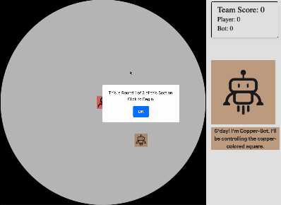

<h1>
Target Intercept Collaborative AI Game
</h1>

This is a collaborative AI game written in JavaScript. Feel free to take inspiration as long as you cite this as inspiration. Email Sheer Karny (skarny@uci.edu) for citation instructions.

<!-- The premise of this game is to work with a collaborative AI agent to gain the highest possible score. Here is what gameplay looks like. -->

<!--  -->

<h2>
Basic overview of the code.
</h2>

Before diving into the details, we need to go into the general way these pages work. Specifically, unique HTML pages have accompanying JavaScript to run the individual game components. The experiment is broken down into three main sections: 1. Consent, 2. Interactive game \& experiment instructions, 3. The full experiment.

_'index.html'_ initializes the web interface for the code. 

<h2>
Experimental flow.
</h2>

There are a range of different game components one can initialize in this game. To begin with, there is an interactive instruction section that involves 4 gameplay sections that teach, successivelly, how to play the game. Instructions begin with 'instructions.html' which points to the these successive pages: 

_'instructions.html'_ --> _'instructions-gameplay-pg1.html'_ --> _'instructions-gameplay-pg2.html'_ --> _'instructions-gameplay-pg3.html'_ --> _'instructions-gameplay-pg4.html'_ --> _'instructions-AI.html'_.

After _'instructions-AI.html'_, which informs the player about the presence of an AI collaborator, the participant is sent is sent to _'integrity-pledge.html'_ where all participants sign an integrity pledge. After signing this, the player is sent to the main experiment, _'game-main-exp.html'_. Once the particpant has completed the experiment, they are redirected to _'complete.html'_ where there is a redirect code back to Prolific.

__Thus, the final flow looks like this:__

_'consent.html'_ --> _'instructions.html'_ --> _'instructions-gameplay-pg1.html'_ --> _'instructions-gameplay-pg2.html'_ --> _'instructions-gameplay-pg3.html'_ --> _'instructions-gameplay-pg4.html'_ --> _'instructions-AI.html'_ --> _'game-main-exp.html'_ --> _'complete.html'_ 

<h3>
The JavaScript children of each of the fornamed HTML pages:
</h3>

* _'instructions.html'_ -- _'instructions.js'_
* _'instructions-gameplay-pg1.html'_ --_'instructions-gameplay-pg1.js'_
* _'instructions-gameplay-pg2.html'_ -- _'instructions-gameplay-pg2.js'_
* _'instructions-gameplay-pg3.html'_ -- _'instructions-gameplay-pg3.js'_
* _'instructions-gameplay-pg4.html'_ -- _'instructions-gameplay-pg4.js'_
* _'instructions-AI.html'_ -- _'instructions-AI.js'_
* _'integrity-pledge.html'_ -- '_integrity-pledge.js'_
* _'game-main-exp.html'_ -- _'new-interface-all-agents.js'_
* _'complete.html'_ -- _'complete.js'_

<h2>
Main experiment game and AI code.
</h2>

<h3>
Overview of the main experiment.
</h3>

There are three important files that control the final experimental function and interface: _'game-main-exp.html'_ , _'new-interface-all-agents.js'_, _'AIplannerv1.5'_. Together, these control the important the full experiment. _'game-main-exp.html'_ controls all the HTML elements and intializes the game engine _'new-interface-all-agents.js'_. The underlying path planning algorithm for each of the collaborative AI agents is in _'AIplannerv1.5'_ and is referenced in the game engine.

<h3>
Understanding the game engine: 'new-interface-all-agents.js'
</h3>

_'new-interface-all-agents.js'_ could be broken down into a few main sections: 

1. Database intialization.
2. Experimental condition intitialization.
3. Rendering and drawing.
4. Game updates.
4. Event handling.
5. Surveys.

<h2>
More important details:
</h2>

<h3>
Skipping through different sections of the game:
</h3>
Starting at line 93 (in the DEBUG conditional), you can manipulate which of the gameplay components to individually open. The default is loading the 'consent.html' page which is the first page all actual participants will encounter. However, you can skip into 1. the main experiment, & 2. the interactive instruction section pages. To do this, you need only intialize the correct HTML attribute that accompanies that page. The code that does this is there for you to uncomment and skip into each of those pages. 

<h2>
Structure of the AI algorithm:
</h2>
