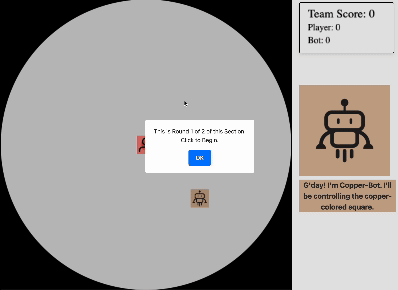

<h1>
Human-AI Collaboration: Trade-offs Between Performance and Preferences
</h1>

A repository for the paper "Human-AI Collaboration: Trade-offs Between Performance and Preferences."

Authors: Lukas W. Mayer1 *†, Sheer Karny 1†, Jackie Ayoub 2, Miao Song 2, Danyang Tian2, Ehsan Moradi-Pari2, Mark Steyvers 1

1 *Department of Cognitive Sciences, University of California, Irvine, Irvine, California, USA.6
Honda Research Institute USA, Inc., Ann Arbor, Michigan, USA.7

E-mail(s): lwmayer[at]uci.edu; skarny[at]uci.edu; mark.steyvers[at]uci.edu;

†These authors contributed equally to this work.
<!-- The premise of this game is to work with a collaborative AI agent to gain the highest possible score. Here is what gameplay looks like. -->

<!--  -->

<h2>
Abstract
</h2>

Despite the growing interest in collaborative AI, designing systems that seamlessly integrate human input remains a major challenge. In this study, we developed a task to systematically examine human preferences for collaborative agents. We created and evaluated five collaborative AI agents with strategies that differ in the manner and degree they adapt to human actions. Participants interacted with a subset of these agents, evaluated their perceived traits, and selected their preferred agent. We used a Bayesian model to understand how agents' strategies influence the Human-AI team performance, AI's perceived traits, and the factors shaping human preferences in pairwise agent comparisons. Our results show that agents who are more considerate of human actions are preferred over purely performance-maximizing agents. Moreover, we show that such human-centric design can improve the likability of AI collaborators without reducing performance. We find evidence for inequality-aversion effects being a driver of human choices, suggesting that people prefer collaborative agents which allow them to meaningfully contribute to the team. Taken together, these findings demonstrate how collaboration with AI can benefit from development efforts which include both subjective and objective metrics.

<h3>
Required Submission Content
</h3>

- System requirements: IDE that can develop in Javascript, CSS, and HTML. Helpful to develop with local host such as VS code's "Live Server"
- No need for installation of external software packages.
- Demo is shown below.
- To understand how to leverage __Google's Firebase Realtime Database__ for gathering data from this experiment, see: https://canvas.eee.uci.edu/courses/54190.
- This experiment gathers structured dictionary data once a Realitme Database is initialized, data gathering methods are uncommented, and demo material is resolved back to full experiment function.
- Instructions for use are described below.

<h2>
How to demo the task:
</h2>

URL parameters allow you to skip past the instructions. Follow this [link](https://madlabatuci.github.io/target-intercept-collab-ai/?debug=true&collab=1) to gain access to the task without instructions. This link adds a URL parameter "__?debug=true__" 

<h4>Teaming Conditions Table</h4>

| Condition | Agent 1 | Agent 2 | Link|
| --------- | --------- | --------- | --------- |
| 1         | ignorant |   delay    |[link](https://madlabatuci.github.io/target-intercept-collab-ai/?debug=true&collab=1)|
| 2         | ignorant | omit       | [link](https://madlabatuci.github.io/target-intercept-collab-ai/?debug=true&collab=2)|
| 3         | ignorant | bottom-feeder |[link](https://madlabatuci.github.io/target-intercept-collab-ai/?debug=true&collab=3)|
| 4         | ignorant | divide |[link](https://madlabatuci.github.io/target-intercept-collab-ai/?debug=true&collab=4)|
| 5         | delay | omit |[link](https://madlabatuci.github.io/target-intercept-collab-ai/?debug=true&collab=5)|
| 6         | delay | bottom-feeder |[link](https://madlabatuci.github.io/target-intercept-collab-ai/?debug=true&collab=6)|
| 7         | delay | divide |[link](https://madlabatuci.github.io/target-intercept-collab-ai/?debug=true&collab=7)|
| 8         | omit | bottom-feeder |[link](https://madlabatuci.github.io/target-intercept-collab-ai/?debug=true&collab=8)|
| 9         | omit | divide |[link](https://madlabatuci.github.io/target-intercept-collab-ai/?debug=true&collab=9)|
| 10        | bottom-feeder | divide |[link](https://madlabatuci.github.io/target-intercept-collab-ai/?debug=true&collab=10)|

URL parameters allow you to access the different teaming conditions. For example, to access teaming condition #1,  use [this link](https://madlabatuci.github.io/target-intercept-collab-ai/?debug=true&collab=1). This link appends another URL parameter "__&collab=1__" to access the correct teaming condition including the AI agents _ignorant_ and _delay_. Adjust the value of __collab__ to access the different teaming conditions.

To see which agent you are currently playing with, access the console logs in the your browser's developer tools. To do this, press __F12__ in Windows or __fn + F12__ in MacOS.

<h4>Default Ordering of AI Agents and Max Targets</h4>

| Round | Current Agent | Current Max Targets|
| --------- | --------- | --------- |
| 1         | AICollab1 | 5 |
| 2         | AICollab2 | 5 |
| 3         | AICollab1 | 15 |
| 4         | AICollab2 | 15 |

<h2>
Basic overview of the code.
</h2>

Before diving into the details, we need to go into the general way these pages work. Specifically, unique HTML pages have accompanying JavaScript to run the individual game components. The experiment is broken down into three main sections: 1. Consent, 2. Interactive game \& experiment instructions, 3. The full experiment.

_'index.html'_ initializes the web interface for the code. 

<h2>
Experimental flow.
</h2>

There are a range of different game components one can initialize in this game. To begin with, there is an interactive instruction section that involves 4 gameplay sections that teach, successivelly, how to play the game. Instructions begin with 'instructions.html' which points to the these successive pages: 

_'instructions.html'_ --> _'instructions-gameplay-pg1.html'_ --> _'instructions-gameplay-pg2.html'_ --> _'instructions-gameplay-pg3.html'_ --> _'instructions-gameplay-pg4.html'_ --> _'instructions-AI.html'_.

After _'instructions-AI.html'_, which informs the player about the presence of an AI collaborator, the participant is sent is sent to _'integrity-pledge.html'_ where all participants sign an integrity pledge. After signing this, the player is sent to the main experiment, _'game-main-exp.html'_. Once the particpant has completed the experiment, they are redirected to _'complete.html'_ where there is a redirect code back to Prolific.

__Thus, the final flow looks like this:__

_'consent.html'_ --> _'instructions.html'_ --> _'instructions-gameplay-pg1.html'_ --> _'instructions-gameplay-pg2.html'_ --> _'instructions-gameplay-pg3.html'_ --> _'instructions-gameplay-pg4.html'_ --> _'instructions-AI.html'_ --> _'game-main-exp.html'_ --> _'complete.html'_ 

<h3>
The JavaScript children of each of the fornamed HTML pages:
</h3>

* _'instructions.html'_ -- _'instructions.js'_
* _'instructions-gameplay-pg1.html'_ --_'instructions-gameplay-pg1.js'_
* _'instructions-gameplay-pg2.html'_ -- _'instructions-gameplay-pg2.js'_
* _'instructions-gameplay-pg3.html'_ -- _'instructions-gameplay-pg3.js'_
* _'instructions-gameplay-pg4.html'_ -- _'instructions-gameplay-pg4.js'_
* _'instructions-AI.html'_ -- _'instructions-AI.js'_
* _'integrity-pledge.html'_ -- '_integrity-pledge.js'_
* _'game-main-exp.html'_ -- _'new-interface-all-agents.js'_
* _'complete.html'_ -- _'complete.js'_

<h3>
To engage the revised experiment you have to reference _'new-interface-all-agents-exp2.js'_ instead of _'new-interface-all-agents.js'_ in the HTML file _'game-main-exp.html'_ .
</h3>

<h2>
Main experiment game and AI code.
</h2>

<h3>
Overview of the main experiment.
</h3>

There are three important files that control the final experimental function and interface: _'game-main-exp.html'_ , _'new-interface-all-agents.js'_, _'AIplannerv1.5'_. Together, these control the important the full experiment. _'game-main-exp.html'_ controls all the HTML elements and intializes the game engine _'new-interface-all-agents.js'_. The underlying path planning algorithm for each of the collaborative AI agents is in _'AIplannerv1.5'_ and is referenced in the game engine.

<h3>
Understanding the game engine: 'new-interface-all-agents.js'
</h3>

_'new-interface-all-agents.js'_ could be broken down into a few main sections: 

1. Database intialization.
2. Experimental condition intitialization.
3. Rendering and drawing.
4. Game updates.
4. Event handling.
5. Surveys.

<h2>
More important details:
</h2>

<h3>
Skipping through different sections of the game:
</h3>
Starting at line 93 (in the DEBUG conditional), you can manipulate which of the gameplay components to individually open. The default is loading the 'consent.html' page which is the first page all actual participants will encounter. However, you can skip into 1. the main experiment, & 2. the interactive instruction section pages. To do this, you need only intialize the correct HTML attribute that accompanies that page. The code that does this is there for you to uncomment and skip into each of those pages. 

<h2>
Structure of the AI algorithm: 'AIplanner-1.5.2.js'
</h2>

Originally called in _'index.html'_.

Two main functions that run the AI planner are _runAIPlanner_ and _planSingleFrame_.
_runAIPlanner_ is called in game engine, _'new-interface-all-agents.js'_, whose outputs guide the AI player's movements. You can find the manipulation of all the AI player's behaviors documented in the main game engine under the comment, 
> Apply the AI type to remove certain objects

and in the AI Planner if the flag for __isBottomFeeder__ is set to 'true'.
